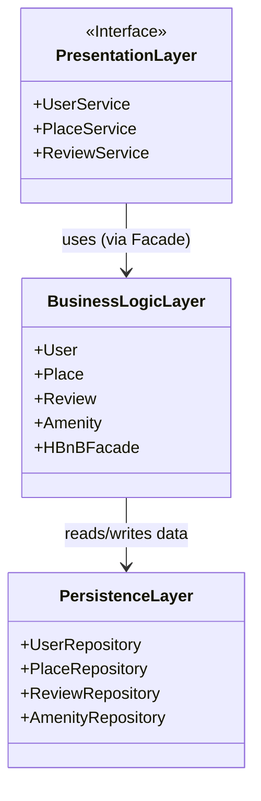
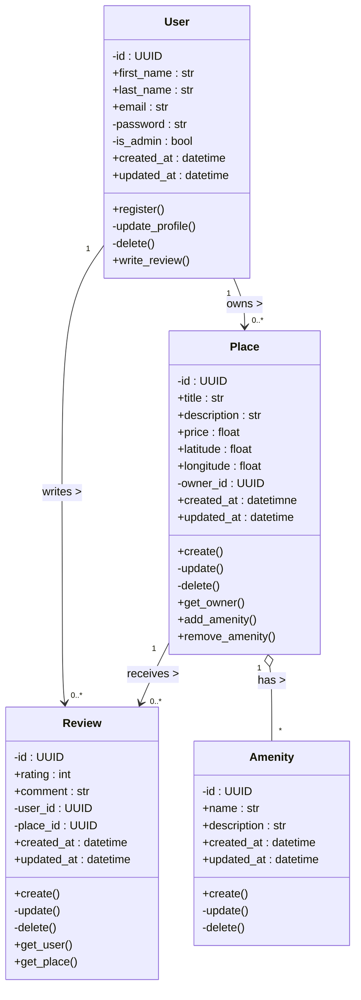
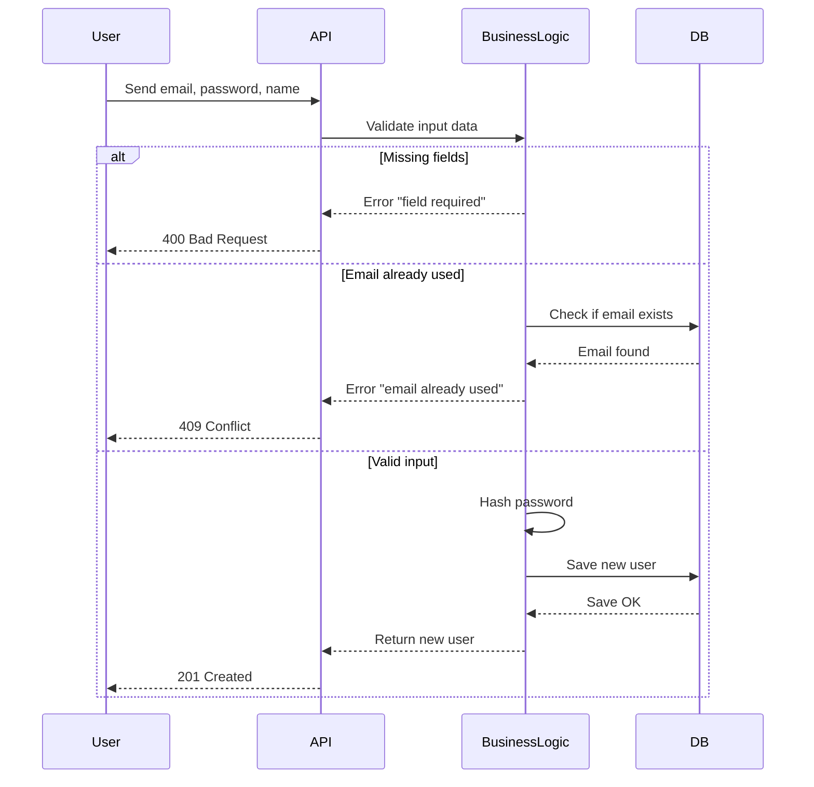

# HBNB – API Design & System Architecture

## 🧾 Introduction

This document presents the system design and internal structure of the **HBNB web application**, following a layered architecture approach.

The main goal of this documentation is to:
- Clearly illustrate how the system is organized across layers (Presentation, Business Logic, and Persistence)
- Detail the data models and their relationships
- Explain how key API endpoints behave using sequence diagrams

All diagrams are written using **Mermaid.js** and aim to help developers quickly understand the backend structure, interaction flow, and responsibility of each component.

---

## 🧱 1. Architecture Overview

This first diagram shows the **three main layers** of the application:

- **Presentation Layer**: Responsible for handling user/API requests.
- **Business Logic Layer**: Processes data, applies rules, and handles core operations.
- **Persistence Layer**: Manages the storage and retrieval of data from the database.


---

## 🧠 2. Business Logic Class Diagram

This diagram provides a detailed view of the **core entities** within the HBNB application’s business logic.

Each class represents a domain concept such as `User`, `Place`, `Review`, or `Amenity`, and includes:

- The **main attributes** (e.g., ID, name, timestamps)
- The **methods** that represent behaviors (e.g., `create()`, `update()`, `delete()`)
- The **relationships** between entities (e.g., a user owns places, places have reviews or amenities)


---

## 🔐 3. User Registration – Sequence Diagram

This sequence diagram illustrates the full process of a **new user registering** on the platform.

It shows how the request moves through the system and how different layers interact to handle:
- Successful registration
- Missing or invalid fields
- Email already in use

The goal is to ensure data is validated, secure, and properly stored in the database. Each actor plays a specific role:

- **User**: Sends registration info (email, password, etc.)
- **API**: Receives the request and forwards it to the logic layer
- **Business Logic**: Validates input, hashes passwords, checks email uniqueness
- **Database**: Stores the user if everything is valid


---

---

## 🏠 4. Place Creation – Sequence Diagram

This sequence diagram shows the full workflow for creating a **new place listing** in the HBNB application.

It represents the step-by-step flow of how a user submits data, and how the backend handles:
- A successful creation of a new place
- Validation errors (e.g., missing title, price)
- Failures due to database issues

The main components involved are:

- **Client**: Sends a POST request to create a place with the required data
- **API**: Receives the request and forwards it to the business logic
- **PlaceService**: Validates the data and interacts with the storage layer
- **Storage**: Handles the insertion of place data into the database

```mermaid
sequenceDiagram
participant Client
participant API
participant PlaceService
participant Storage

Client->>API: POST /places (title, description, price, etc.)
API->>PlaceService: process_new_place(data)

alt All required fields are valid
    PlaceService->>Storage: insert_place(data)
    Storage-->>PlaceService: return place_id
    PlaceService-->>API: return created place
    API-->>Client: 201 Created { "id": place_id, ... }
else Validation error
    PlaceService->>PlaceService: check required fields
    PlaceService-->>API: return "Missing required fields"
    API-->>Client: 422 Unprocessable Entity { "error": "Missing title" }
else Database error
    PlaceService->>Storage: insert_place(data)
    Storage-->>PlaceService: error (DB down)
    PlaceService-->>API: return database error
    API-->>Client: 503 Service Unavailable { "error": "Database issue" }
end
